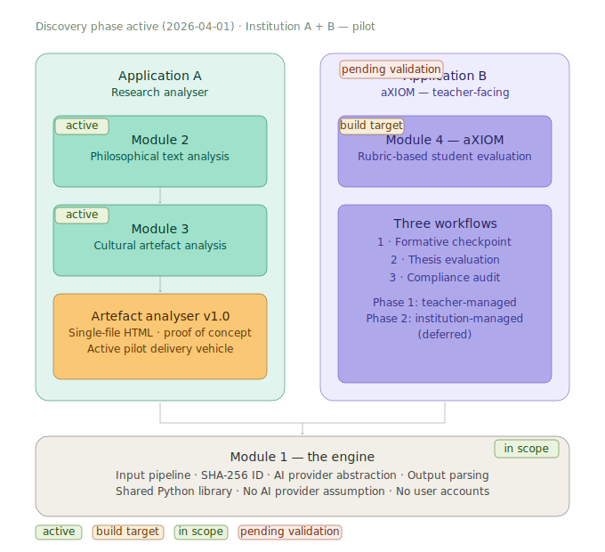

# aXIOM — ARCHITECTURE.md

Living Architecture Document — Version 0.1 | Last updated: 2026-04-19

---

> This document captures all architecture decisions made to date. Decided items are closed and committed. Open items are explicitly marked as pending. Deferred items are recorded for future phases. This document must be updated at the end of every planning session.

## 0. Platform architecture


---

## 1. Platform Overview

The platform consists of four modules organised into two applications sharing one common engine.

### 1.1 The Four Modules

| Module | Name | Status |
|--------|------|--------|
| 1 | The Engine | In scope — phase 1 |
| 2 | Philosophical Text Analysis | Active — delivered via Artefact Analyser v1.0 |
| 3 | Cultural Artefact Analysis | Active — delivered via Artefact Analyser v1.0 |
| 4 | aXIOM | In scope — phase 1 |

### 1.2 The Two Applications

**Application A — Research Analyser**
Modules 2 and 3. Researcher-facing. Philosophical text analysis and cultural artefact analysis. Zotero integration. Currently delivered as Artefact Analyser v1.0 — a single-file HTML tool in active informal use. Full platform build follows Module 4.

**Application B — aXIOM**
Module 4. Teacher-facing. Rubric-based student work evaluation against institutional requirements. No Zotero dependency. Primary build target for phase 1.

aXIOM manages analytical overhead in the analysis phase of the academic work cycle — it does not replace human synthesis. The teacher reads, challenges, and decides. The tool carries the paperwork load.

### 1.3 The Engine
Shared infrastructure underneath both applications. Input pipeline, 
content extraction, SHA-256 ID system, AI provider communication, 
response parsing, and structured output generation. Packaged as a 
shared Python library. No AI provider assumption. No user accounts. 
No Zotero dependency.

Analytical schema, claim taxonomy, and inference logic belong to the 
prompt layer — not the engine. Each application uses its own prompt: 
the Research Analyser uses the Core Prompt (see `prompts/`), aXIOM 
uses a separate Assessment Prompt informed by institutional context. 
See `docs/ENGINE_ARCHITECTURE.md` for the three-layer separation 
(transport / prompt / output) and section selection decisions.

---

## 2. aXIOM — Scope and Workflows

### 2.1 Primary User
The teacher. Sole user and recipient of all output in phase 1.

### 2.2 Three Workflows

**Workflow 1 — Formative checkpoint**
Teacher assesses student work during the course and receives structured feedback plus improvement recommendations.

**Workflow 2 — Thesis evaluation**
Higher stakes assessment feeding into a grading decision.

**Workflow 3 — Compliance audit**
Retrospective evaluation of finished, graded work against departmental or institutional requirements.

### 2.3 Compliance Standard — Two Layers

| Layer | Source | Configured by |
|-------|--------|---------------|
| Programme requirements | Institution/department programme regulations | Teacher (phase 1) → Admin/supervisor (phase 2) |
| Teacher criteria | Individual academic judgment within programme requirements | Teacher |
| AI use policy | Institution/department AI use regulations for students | Not yet in wizard scope — see §14 Open Questions |

National law is a background assumption. The institution is trusted to have produced programme requirements compliant with national law. The tool does not monitor legal compliance.

### 2.4 Phase Structure

**Phase 1 — Teacher-managed, deployable**
Single teacher per installation. Teacher inputs and owns all configuration. Report is for teacher's eyes only. Printing supported. No sharing or export beyond print.

**Phase 2 — Institution-managed (deferred)**
Admin/supervisor owns programme requirements configuration. Multiple teachers share institutional standard. Teacher-mediated student feedback added. Direct student output explicitly excluded until phase 2 is designed carefully.

---

## 3. Requirement Configuration

### 3.1 Model
Hybrid. Two layers:

**Layer 1 — Structured wizard (mandatory)**
A step-by-step guided form covering fields that every assessment requires. The engine relies on these directly for assessment logic.

**Layer 2 — Free text extension**
Anything Layer 1 does not capture. Written by the teacher in natural language. Treated as supplementary context by the engine — informs assessment but is not parsed into discrete checks.

### 3.2 Wizard Structure (Layer 1)
Steps flow in this order:

1. Assignment context (type, level, who it is for)
2. Programme requirements (institutional fixed layer)
3. Teacher criteria (interpretive layer within programme requirements)
4. Free text extension (Layer 2 — anything not covered above)
5. Review and confirm (teacher sees complete requirement set, can return to any step before saving)

#### Step 1 — Assignment context

Provides the basic framing for the assessment. Feeds `{{OUTPUT_LANGUAGE}}` and supplies context for §0 (Assessment Configuration) and §2.1 (Document Check) of the Assessment Prompt.

| Field | Type | Options / notes |
|-------|------|-----------------|
| Assignment type | Select | Essay, Seminar paper, Bachelor thesis, Master thesis, Project report, Portfolio, Other (reveals free-text field) |
| Academic level | Select | Bachelor, Master, Doctoral, Other (reveals free-text field) |
| Discipline / field | Text | Free text — e.g. Fine Arts, Applied Sciences, Philosophy |
| Input language | Select | Polish, English, German — the language the student work is actually written in. Phase 1 supports these three languages only. |
| Output language | Select | Polish, English, German — the language the assessment report is produced in |

**Input language and submission language requirement:** Input language (Step 1) records the language the student actually submitted in. Submission language requirement (Step 2) records the programme's formal language requirement. If these differ, the mismatch is surfaced as a formal compliance finding in §2.3 of the assessment report. The engine does not block assessment on a mismatch — the teacher reviews and decides.

#### Step 2 — Programme requirements (Studienordnung)

Configures `{{INSTITUTION_FRAMEWORK}}`. Stored per institution/programme. Intended to be configured once and reused across assessments for the same programme.

| Field | Type | Options / notes |
|-------|------|-----------------|
| Programme name | Text | e.g. BA Fine Arts, MA Applied Sciences |
| Regulation document reference | Text | Document title and year — e.g. Studienordnung 2023 §4 |
| Required length | Text | Minimum and/or maximum — e.g. 8 000–10 000 words |
| Required structural elements | Multi-select | Abstract, Introduction, Theoretical framework, Methodology, Analysis, Discussion, Conclusion, Bibliography, Appendices |
| Required citation style | Select | APA, MLA, Chicago, Harvard, Institutional style, None specified |
| Submission language requirement | Select | Polish, English, German, Any — the language the submission must be written in per programme regulations |
| Grading scale | Text | e.g. 2–5 (Polish), A–F, 0–100 |
| Programme learning outcomes | Textarea | What the programme formally expects — used verbatim in requirements alignment |
| Additional programme requirements | Textarea | Anything not captured in the fields above |

#### Step 3 — Teacher criteria

Configures `{{SEMINAR_REQUIREMENTS}}`. Configured per course. Can reference and extend programme requirements but cannot override them. The wizard checks for conflicts between teacher criteria and programme requirements on save. If a conflict is detected, the teacher is shown a plain-language explanation of the conflict and asked to resolve it before proceeding — assessment cannot run against conflicting requirements.

| Field | Type | Options / notes |
|-------|------|-----------------|
| Course / seminar name | Text | e.g. Qualitative Research Methods, Contemporary Art Theory |
| Semester | Text | e.g. Winter 2026 |
| Assignment brief | Textarea | The task description given to students — verbatim or summarised |
| Required analytical approach | Text | e.g. Grounded theory, Discourse analysis — leave blank if none specified |
| Analytical depth expected | Select | Introductory, Intermediate, Advanced |
| Original argument required | Radio | Required, Optional, Not applicable |
| Source requirements | Text | e.g. Minimum 10 scholarly sources, primary sources required |
| Specific evaluation criteria | Repeating block | One criterion per entry — label and description. No fixed upper limit. |
| Additional teacher criteria | Textarea | Anything not captured in the fields above |

### 3.3 Three Operations on Requirement Sets

| Operation | Description | Versioning behaviour |
|-----------|-------------|----------------------|
| Create | Full wizard, empty fields | Saves as version 1 |
| Correct | Jump to relevant step, change what is wrong | Saves as version 2 of same set. Previous assessments flagged for review |
| Branch | Duplicate existing set, full wizard prepopulated, modify as needed | Saves as new independent requirement set. Previous assessments untouched |

Version history is maintained. Every assessment record is linked to the specific version of the requirement set it was run against.

---

## 4. Structured Output — Parsing and Failure Handling

### 4.1 The Pipeline
Raw model output
→ Validation layer
→ Retry logic (max 3 attempts)
→ Confidence scoring
→ Report assembly
→ Teacher review

### 4.2 Three Failure Modes and Their Solutions

| Failure mode | Description | Solution |
|--------------|-------------|----------|
| Incomplete output | Model stops mid-assessment, fields missing | Retry with continuation prompt. After 3 retries: graceful failure message to teacher |
| Malformed output | Structure wrong, cannot be parsed | Validation layer catches it, retry with explicit format instruction. Raw output preserved so teacher can see what model produced |
| Shallow output | Structurally complete but analytically empty | Cannot be caught automatically. Transparency in report: confidence indicators per section, raw evidence cited from student text visible to teacher |

---

### 4.3 Retry Limit
Maximum 3 retries across all failure types. After 3 retries the assessment fails gracefully with a plain-language error message. No cryptic technical errors exposed to the teacher.

---

## 5. Technology Stack

### 5.1 Decisions

| Component | Choice | Rationale |
|-----------|--------|-----------|
| Backend | Python + FastAPI | Best AI-assistant support, readable, strong document processing libraries |
| Database | PostgreSQL | Reliable, Unicode-native, row-level security for phase 2 multi-tenancy |
| Frontend | Plain HTML + CSS + JavaScript | No framework overhead, close to existing HTML tool in spirit, maintainable solo |
| Containerisation | Docker + Docker Compose | Single command deployment, platform-independent, one-file stack definition |
| Package | Deployable container | Distributed as software, not a hosted service (phase 1) |

### 5.2 Development Environment
Ubuntu desktop (local). Docker Compose runs the full stack locally. PostgreSQL runs in a container alongside the application. Browser points to localhost for the frontend.

### 5.3 Platform Support
Linux (Ubuntu) — primary development environment. Mac (Intel and Apple Silicon) — must be explicitly tested before pilot. Windows (WSL2) — supported via Docker Desktop. All platforms supported via Docker — no platform-specific code.

---

## 6. Deployment Model

### 6.1 Phase 1 — Deployable Application
Distributed as a Docker Compose package. Institution or teacher installs Docker, runs one command, opens browser. No server infrastructure managed by the project. No hosted service. No ongoing operational responsibility.

### 6.2 Phase 2 — SaaS (deferred)
Hosted version added alongside deployable version. Teachers who cannot install Docker use the hosted version. Institutions requiring data sovereignty use their own deployment. Architecture is designed to support both from day one without requiring a rebuild.

### 6.3 Architecture Discipline for SaaS Readiness
The following must be true from the first line of code to keep the SaaS path open:
- No hardcoded infrastructure assumptions
- Database queries scoped correctly for future multi-tenancy
- Authentication abstracted, not hardcoded to one provider
- All text strings in translation files, never hardcoded in UI

### 6.4 Update Mechanism for Local Installations

Teachers update by running `bash update.sh` from the installation directory.
The script is included in every release package alongside `docker-compose.yml`.

**Design principles**

- Data is never at risk during an update. The database lives in a named Docker
  volume (`axiom_pgdata`) that persists independently of the application
  containers. Pulling a new image and restarting the containers does not touch
  the volume.
- A timestamped SQL dump (UTF-8 encoded) is created before any container is
  stopped. If the update fails, the restore command is printed to the terminal.
- Schema migrations are applied automatically as part of the application startup
  sequence (Alembic `upgrade head`). No manual migration step. Multiple version
  jumps are handled in one pass.
- The update script performs a health check after restart and reports success or
  failure with plain-language instructions. No cryptic output.

**Update sequence**

| Step | What happens |
|------|-------------|
| 1 | Pre-update database backup created (`backups/axiom_backup_TIMESTAMP.sql`) |
| 2 | `docker compose pull` — new images downloaded |
| 3 | `docker compose down` — running containers stopped gracefully |
| 4 | `docker compose up --detach` — new containers started; Alembic runs migrations |
| 5 | Health check against `/health` endpoint; success or rollback instructions |

**Rollback**

If the health check fails, the previous image is still cached by Docker.
The teacher can restart with the previous image and restore the database from
the backup file using the command printed by the update script.

**Backup retention**

Backups accumulate in `./backups/`. The teacher is instructed to delete old
files once satisfied with the update. No automatic deletion — the teacher
confirms deletion in line with the GDPR retention principle (§11).

**Reference files**

- `update.sh` — update script (included in release package)
- `docs/UPDATING.md` — plain-language guide for teachers

---

## 7. AI Provider Abstraction Layer

### 7.1 Scope
Both applications support multiple AI providers. The engine itself has no AI provider assumption. Provider abstraction is implemented at the application layer in both the Research Analyser and aXIOM.

The Research Analyser (modules 2 and 3) uses the same provider abstraction pattern as aXIOM. This is consistent with the legacy Artefact Analyser v1.0, which already implements multi-provider support (Anthropic, OpenAI, Azure OpenAI, custom endpoints). The rebuild preserves this.

### 7.2 Phase 1 Supported Configurations

| Provider | Authentication | Priority |
|----------|---------------|----------|
| Anthropic Claude | API key | Primary — day one |
| OpenAI GPT | API key | Day one — same pattern as Anthropic |
| Azure OpenAI | Endpoint URL + API key + deployment name | Phase 2 |
| Self-hosted local models | Configurable endpoint, no auth | Phase 2 — named candidates for Polish pilot context: Bielik and Plum (Polish-language LLMs, locally installable, no internet dependency; relevant for institutions with data sovereignty requirements) |

### 7.3 Capability Probe
Runs at setup against any unlisted or custom AI endpoint. Tests:
- Structured output compliance (can the model return parseable schema output?)
- Instruction following fidelity (does it activate correct fields per mode?)
- Response length (does it truncate before completing the schema?)
- Image input support (does it handle embedded visual content?)
- Polish and German language handling (separate test documents per language)

**Probe outcomes:**

| Result | Meaning | Action |
|--------|---------|--------|
| Green | Full compliance | Proceed normally |
| Yellow | Partial compliance — known limitations | Flag degraded capabilities in UI, proceed with warnings |
| Red | Structural compliance failure | Cannot proceed — clear plain-language explanation to administrator |

Known-compatible model configurations skip the full probe and receive immediate green.

### 7.4 Visual Content Handling
**Option B (default):** Extract text and embedded images from student submissions. Pass both to AI model for complete assessment.

**Option C (automatic fallback):** If model fails image capability check in probe, switch to text-only extraction. Flag clearly in every report that visual content was present but not assessed. Teacher sees warning at setup. Particularly relevant for Institution A (art academy) where visual content in student work is the norm.

### 7.5 Prompt Template Design
All prompt templates written for model-agnostic use. No provider-specific prompting techniques in either application's prompts. Templates must produce consistent structured output across supported providers.

---

## 8. Multilingual Architecture

### 8.1 Language Settings
Three independent settings, each configurable separately:

| Setting | Description |
|---------|-------------|
| UI language | Language the teacher navigates the application in |
| Input language | Language the student work is written in |
| Output language | Language the assessment report is produced in |

### 8.2 Languages

| Language | Status | Notes |
|----------|--------|-------|
| English | Ships with v1.0 | Master language — source of truth for all strings |
| Polish | Ships with v1.0 | AI-translated, human reviewed |
| German | Ships with v1.1 | AI-translated, human reviewed |
| Additional languages | N-language architecture — add translation file, no code changes | Future |

### 8.3 Translation Discipline
English is written and finalised first. Translation runs only on stable English content. A translation status table is maintained in this document (see Appendix A). All translation files are JSON with explicit UTF-8 encoding.

### 8.4 Capability Probe — Language Testing
The probe tests the configured AI model in both Polish and German using native academic text — not translations of English test documents. Each test document contains all language-specific diacritics deliberately.

---

## 9. UTF-8 Compliance

UTF-8 is a standing requirement across every component. The following checklist applies to every new component added to the stack.

### 9.1 UTF-8 Compliance Checklist
- [ ] Database initialised with explicit UTF-8 encoding
- [ ] PostgreSQL collation configured for Polish and German text columns
- [ ] Docker container locale set to UTF-8 (Dockerfile)
- [ ] .gitattributes enforces UTF-8 without BOM for all text files
- [ ] FastAPI responses declare charset=utf-8 in Content-Type header
- [ ] File input pipeline preserves encoding through every processing step
- [ ] Filenames with diacritics handled correctly in upload and storage
- [ ] Log files configured for UTF-8 output
- [ ] Translation JSON files saved as UTF-8 without BOM
- [ ] AI API calls encode request body as UTF-8
- [ ] All prompt templates declare expected input and output language explicitly
- [ ] Capability probe test documents contain all Polish diacritics (ą ć ę ł ń ó ś ź ż) and German umlauts (ä ö ü ß)

---

## 10. Student Work File Formats

### 10.1 Supported Formats (Phase 1)

| Format | Notes |
|--------|-------|
| DOCX | Primary format — must work perfectly |
| PDF | Text-layer PDFs only. Scanned PDFs not supported |
| TXT | Edge case — trivial to support |
| RTF | Relevant for Mac users (TextEdit default) and older systems |
| ODT | Relevant for LibreOffice users — common in European academic institutions |

### 10.2 Explicitly Excluded (Phase 1)
Pages (.pages), scanned PDFs, handwritten work, standalone image files (JPG, PNG).

### 10.3 Unsupported Format Handling
Graceful failure with a plain-language message explaining the format is not supported and what format to request from the student instead. No crashes, no cryptic errors.

---

## 11. Data Retention

### 11.1 Retention Period
Study cycle length plus one year. Configured at setup by the teacher. Applies to all document types including thesis work.

### 11.2 Deletion Behaviour
Automatic flagging when records reach expiry date. Teacher receives notification and confirms deletion — records are not deleted silently. Teacher can manually delete any record at any time before expiry.

### 11.3 Rationale
Student work is personal data under GDPR. The institution owns the data in a locally deployed installation. The tool provides explicit retention and deletion controls so the institution can meet its own data governance obligations.

---

## 12. Report Output

### 12.1 Phase 1
On-screen report displayed in the browser. Print stylesheet included from day one — designed alongside the screen report, not retrofitted. Print via browser (Ctrl+P) produces a clean, well-formatted output suitable for physical filing.

### 12.2 Print Stylesheet Requirements
- Hides navigation, buttons, and UI chrome
- Page breaks at section boundaries, never mid-finding
- Black and white friendly — no colour-dependent meaning
- Polish and German characters render correctly (handled by browser)
- Typography clear at print resolution

### 12.3 Phase 2 (deferred)
PDF export, DOCX export, direct sharing with examination boards.

### 12.4 Report Structure

The assessment report has seven sections (§0–§6). On screen they are
presented in reading order: §6 (Assessment Report) appears first because
it is the teacher-facing human-readable summary. §5 (Requirements
Alignment) is also open by default. §§0–4 contain the analytical detail
and are collapsed by default, expandable on demand.

**On-screen section order:**

| Position | Section | Default state | Purpose |
|----------|---------|---------------|---------|
| 1 | §6 Assessment Report | Open | Human-readable summary — the teacher reads this first |
| 2 | §5 Requirements Alignment | Open | Core criteria evaluation — load-bearing for grading decisions |
| 3 | §2 Document Check | Collapsed | Structural and formal check — teacher expands if formal issues are flagged |
| 4 | §3 Core Argument Analysis | Collapsed | Thesis identification and argument structure |
| 5 | §4 Argument Quality Assessment | Collapsed | Logical validity, evidential support, reasoning errors |
| 6 | §1 Submission Context | Collapsed | Confirms which requirements were loaded — useful for audit |
| 7 | §0 Assessment Configuration | Collapsed | System-level metadata — primarily for audit and debugging |

**Section contents:**

**§6 — Assessment Report** (always open; teacher reads this first)
- **6.1 Overall impression** — 1–2 sentence holistic judgment of the submission
- **6.2 Strengths** — up to 5 genuine strengths with evidence citations; list is not inflated — fewer listed if fewer genuine strengths exist
- **6.3 Areas for development** — significant shortfalls with evidence and a concrete description of what adequate development would look like
- **6.4 Unmet requirements** — all requirements from §5 assessed as not-met, listed explicitly; states clearly if none
- **6.5 Assessment confidence** — overall confidence level (high / medium / low) with 2–3 sentence rationale; lists elements that could not be assessed and explains why

**§5 — Requirements Alignment** (always open)
- **5.1 Programme requirements alignment** — each requirement evaluated: met / partially-met / not-met / not-assessable, with evidence citation and per-finding confidence level
- **5.2 Seminar requirements alignment** — same structure as 5.1
- **5.3 Alignment summary** — counts by status, list of critical gaps (not-met findings that are likely load-bearing for the grade decision), and overall section confidence level

**§2 — Document Check** (collapsed)
- **2.1 Basic identification** — language, document type, word count, modality (text-only or multimodal)
- **2.2 Structural elements check** — standardised checklist of academic structure elements (abstract, introduction, theoretical framework, methodology, analysis, discussion, conclusion, reference list, appendices); each element: present / absent / present-but-underdeveloped / not-required
- **2.3 Formal compliance check** — requirements-anchored check of formal requirements (length, format, citation style, language, anonymisation)
- **2.4 Notable gaps vs requirements** — each gap given a gap_id (G1, G2…), classified by severity (structural / content / formal), anchored to the specific requirement

**§3 — Core Argument Analysis** (collapsed)
- **3.1 Thesis identification** — status: yes (clear thesis) / unclear / no; with mandatory confidence indicator
- **3.2 Supporting claims** — for each claim: type (thesis-support / methodological / descriptive / conclusion), evidence basis, connection to thesis (strong / weak / unclear / absent), and confidence level
- **3.3 Argument structure summary** — 2–4 sentences on whether supporting claims are additive or redundant

**§4 — Argument Quality Assessment** (collapsed)
- **4.1 Argument reconstruction** — premises → conclusion; implicit premises flagged
- **4.2 Logical validity** — validity and soundness check; specific reasoning gaps listed
- **4.3 Evidential support** — quantity (sufficient / insufficient / excessive-but-superficial), quality (appropriate-for-level / below-expectations / above-expectations), and integration (claim-anchored or listed without integration); specific citation issues listed
- **4.4 Informal reasoning errors** — included only if present; each anchored to a specific passage and classified by severity (minor / significant / structural); taxonomy: overgeneralisation, unsupported-causal-claim, appeal-to-authority, straw-man, false-equivalence, circular-reasoning
- **4.5 Assumption check** — significant undefended assumptions classified as load-bearing or peripheral, and as defended / partially-defended / undefended

**§1 — Submission Context** (collapsed)
- Confirmation that INSTITUTION_FRAMEWORK, SEMINAR_REQUIREMENTS, and MANUAL_NOTES have been received
- 1–3 sentence summary of what each layer requires
- Flags any requirement that is ambiguous, internally conflicting, or in conflict with another layer

**§0 — Assessment Configuration** (collapsed)
- System metadata: SUBMISSION_ID, GENERATED_AT, analytical framework (always "criteria-based academic assessment"), assessment mode (always "interpretive"), output language
- Four standing system-level limitations declared verbatim (L1: AI findings require teacher review; L2: AI cannot assess originality or detect plagiarism; L3: visual content may not be fully assessable in text-only mode; L4: assessment quality depends on the accuracy of the requirements provided)

---

**Confidence indicators**

Three levels are used throughout the report:

| Level | Label | Screen colour | Print rendering |
|-------|-------|---------------|-----------------|
| High | High confidence | Green | Filled circle ● |
| Medium | Medium confidence | Amber | Half-filled circle ◑ |
| Low | Low confidence | Red | Empty circle ○ |

Indicators are text-labelled at all times. Colour is supplementary and
never the sole carrier of meaning (print-safe per §12.2).

Confidence indicators appear:
- On thesis identification in §3.1
- Per claim in §3.2
- At subsection level throughout §4
- Per individual requirement finding in §5.1 and §5.2
- At section level in §5.3
- As the overall assessment confidence in §6.5

The overall confidence level in §6.5 is derived conservatively from the
lowest explicitly reported confidence-bearing output across analytical
sections (§§2–5). Where a section exposes only per-finding, per-claim, or
thesis-level confidence rather than a section-level value, that section is
treated as low if any such item is low, high only if all such items are
high, and medium otherwise. Accordingly, if any analytical section (§§2–5)
yields low confidence under this rule, the overall is low; if all yield
high, the overall is high; mixed cases yield medium.

---

## 13. Pilot Programme

### 13.1 Target Institutions
- Institution A — Academy of Fine Arts (Poland)
- Institution B — University of Applied Sciences (Poland)

### 13.2 Pilot Approach
**Phase 1 pilot:** One identified teacher. Observed live session. Tool used independently without facilitation guidance. Facilitator observes and takes notes using the Pilot Discovery Document.

**Phase 2 pilot:** Wider group of testers using the tool independently and submitting self-reported feedback using the same document.

### 13.3 Pilot Discovery Document
Separate document. Filed in repository as `docs/pilot_discovery_document.docx`. Covers pre-session baseline, setup observation (with focus on API key friction), first use observation, debrief questions, and facilitator summary. Designed to work for both observed and self-reported sessions.

### 13.4 Known Friction Points
API key setup is a confirmed friction point from prior observation. The setup wizard must treat API key configuration as a first-class onboarding problem — dedicated wizard step, inline guidance, visible test confirmation, plain-language error messages, cost estimate display.

1:1 onboarding required. Group format insufficient for tool introduction. Individual sessions needed. The tool's utility is embedded in individual professional practice — access to the Lebenswelt of the individual assessor requires a 1:1 setting.

---

## 14. Onboarding Flow

### 14.1 Design Rationale
API key setup is a confirmed friction point from pilot observation (§13.4). The onboarding wizard treats it as a first-class problem, not an afterthought. Every design decision in the wizard follows from that priority.

### 14.2 Wizard Steps

The onboarding wizard runs once on first launch and produces a fully configured, probe-verified installation. It has five steps.

| Step | Name | Purpose |
|------|------|---------|
| 1 | Welcome | Orient the teacher. Name the tool. State what they will need. Set the five-minute expectation. |
| 2 | Choose provider | Select Anthropic Claude or OpenAI GPT. Cards show description and account creation link. Anthropic is pre-selected and recommended for Polish-language work. |
| 3 | Configure API key | Dedicated step. First-class treatment — see §14.3. |
| 4 | Capability probe | Automated check of the configured provider. Results shown per check. Known-compatible model configurations skip to green. See §14.4. |
| 5 | Ready | Confirmation with configuration summary. Launch button to main application. |

### 14.3 API Key Step — First-Class Treatment

The API key step is designed around the confirmed friction point. Requirements:

- **Dedicated step** — API key is not combined with other configuration.
- **Step-by-step instructions** — numbered, provider-specific. Links to the exact console page where the key is found. No assumption that the teacher knows what an API key is or where to find it.
- **Show/hide toggle** — password field with visible toggle. The teacher can verify what they pasted without exposing the key by default.
- **Test connection button** — calls the live API with a minimal probe request before the teacher proceeds. The Continue button is disabled until the test passes.
- **Plain-language error messages** — no technical codes or HTTP status messages exposed. Specific guidance per failure type: empty key, wrong format, rejected key, rate limit, network failure. Each message tells the teacher what to do next.
- **Security note** — explicit statement that the key is stored only on the device and sent only to the provider's API. Shown on the step, not buried in a help page.
- **Cost estimate** — single-line estimate (€0.01–€0.05 per assessment) shown on the step. Cost is not revealed after setup; it is part of the informed consent at configuration time.

### 14.4 Capability Probe

Runs in step 4 immediately after the API key step. Three checks:

| Check | What it tests | Pass condition |
|-------|--------------|----------------|
| Connection | Can the tool reach the provider API? | Already established by test in step 3. Marked pass immediately. |
| Structured output | Does the model follow a JSON schema reliably? | Model returns valid JSON matching the required schema. |
| Polish language handling | Does the model handle Polish diacritics correctly? | Model processes and acknowledges Polish text containing all Polish diacritics. |

**Known-compatible model configurations** (all Phase 1 supported models) skip the full probe and receive immediate green. Full probe runs only for unlisted or custom model configurations.

**Probe outcomes:**

| Result | Meaning | Action |
|--------|---------|--------|
| Pass | All checks passed or skipped (known-compatible) | Continue to step 5 |
| Warn | One or more checks passed with limitations | Continue button labelled "Continue with warnings →". Warnings shown on screen. Probe result stored and surfaced in main app. |
| Fail | Structural failure — tool cannot run assessments | Continue blocked. Teacher directed back to step 3 to change provider or model. Plain-language explanation shown. |

### 14.5 i18n
All wizard strings are in `axiom/i18n/en.json` (English master) and `axiom/i18n/pl.json` (Polish). The wizard auto-detects browser language and loads the appropriate file. Falls back to English if the locale file is missing. No strings are hardcoded in HTML or JavaScript.

### 14.6 Implementation Files

| File | Purpose |
|------|---------|
| `axiom/onboarding.html` | Wizard HTML — five step sections, static structure |
| `axiom/css/onboarding.css` | Wizard styles — matches design language of legacy tool |
| `axiom/js/config.js` | Config management — localStorage, onboarding state, probe result |
| `axiom/js/providers/anthropic.js` | Anthropic provider plugin — validation, headers, test and probe request builders |
| `axiom/js/providers/openai.js` | OpenAI provider plugin — same interface |
| `axiom/js/onboarding.js` | Wizard logic — step navigation, test connection, capability probe, i18n |
| `axiom/i18n/en.json` | English translation strings (master language) |
| `axiom/i18n/pl.json` | Polish translation strings |

---

## 15. Open Questions (To-Do List)

| Item | Description | Depends on |
|------|-------------|------------|
| Wizard Layer 1 fields | Specific fields within each wizard step | Further design session |
| Print stylesheet design | Detailed design of print output | ~~Report structure decision~~ Report structure decided (§12.4) — can now proceed |
| Print footer localisation | CSS `@page` margin-box `content` properties cannot access the JavaScript i18n system. The running footer in `legacy/css/print.css` is English-only. Candidate approaches: (a) server-side generation of a locale-specific `<style>` block, (b) JavaScript injection of a locale-specific `@page` rule before the browser print dialog opens. Decision deferred until report structure and i18n pipeline are finalised. | Report structure decision; i18n pipeline |
| Cost visibility | ~~Whether and how to show token usage and estimated cost per assessment run~~ **Resolved — see decision log** | — |
| Update mechanism | ~~How teachers update their installation without losing data~~ **Closed — see §6.4** | — |
| Connection between modules 3 and 4 | How cultural artefact analysis output (module 3) relates to aXIOM assessment (module 4) | Deferred until module 3 is in scope |
| Translation status tracking | ~~Per-string translation status for Polish and German~~ **Resolved** — `tools/check_translations.py` compares language JSON files against `en.json` and reports per-string status. See Appendix A. | — |
| Student-facing variant | Self-check tool for students before submission | Roadmap — deferred, not v1.0 scope |
| Institutional AI policy field in wizard | Should the wizard include a field for the teacher to declare the institution's current AI use policy for students? Polish institutions are only beginning to formalise these policies (Polish HEI 2024, Polish HEI 2025). Without this field, Workflow 3 (compliance audit) may miss a layer of the institutional compliance standard. | Further design session |
- **Institutional AI disclosure obligation**: aXIOM produces AI-assisted assessment output. Whether institutions are required to inform students that AI was involved in evaluating their work is currently unregulated but closing fast (cf. Elsevier GenAI Policy Sept. 2025, boundary between "assistance" and "research-process use" undefined). aXIOM must take an explicit position before pilot institutions ask. Candidate approaches: (a) mandatory disclosure template generated with every report, (b) configurable per institution, (c) documented as institution's responsibility. Decision deferred pending pilot feedback and Polish HEI regulatory scan.

---

## 16. Deferred Items (Phase 2)

- Admin/supervisor institutional configuration layer
- Multi-tenant data isolation and row-level security
- Student-facing feedback (teacher-mediated)
- Student self-check variant (roadmap)
- SaaS hosted version
- Azure OpenAI and self-hosted model authentication
- PDF and DOCX report export
- Direct sharing with examination boards
- Zotero integration (modules 2 and 3 only)
- Research Analyser full platform build (Modules 2 and 3 — currently active as Artefact Analyser v1.0)

---

## Appendix A — Translation Status

### Tooling

Per-string translation status is tracked automatically by `tools/check_translations.py`.
Run it from the repository root to see which strings are missing or untranslated:

```
python tools/check_translations.py           # report all languages
python tools/check_translations.py --lang pl # report Polish only
python tools/check_translations.py --strict  # exit 1 if any strings are incomplete
```

Status key used in the script output:

| Symbol | Meaning |
|--------|---------|
| ✅ | Translated — value present and non-empty |
| ✏️ | In progress — key present in language file but value is empty |
| ⬜ | Missing — key absent from language file entirely |

### Per-group status

The table below is a high-level view updated by hand when a group reaches a milestone.
Run `check_translations.py` for the authoritative per-string detail.

| String group | English | Polish (v1.0) | German (v1.1) |
|--------------|---------|---------------|----------------|
| UI navigation (header, tab, panel) | ✅ Approved | ✏️ In progress | ⬜ Pending |
| Modal / provider config | ✅ Approved | ✏️ In progress | ⬜ Pending |
| Buttons | ✅ Approved | ✏️ In progress | ⬜ Pending |
| Labels and placeholders | ✅ Approved | ✏️ In progress | ⬜ Pending |
| Status / error messages | ✅ Approved | ✏️ In progress | ⬜ Pending |
| Wizard steps | ⬜ Pending | ⬜ Pending | ⬜ Pending |
| Report output | ⬜ Pending | ⬜ Pending | ⬜ Pending |
| Capability probe messages | ⬜ Pending | ⬜ Pending | ⬜ Pending |
| Onboarding and setup | ✅ Approved | ✅ Approved | ⬜ Pending |

### Language files

| File | Language | Scope | Ships with |
|------|----------|-------|------------|
| `legacy/i18n/en.json` | English (master) | Artefact Analyser v1.0 | v1.0 |
| `legacy/i18n/pl.json` | Polish | Artefact Analyser v1.0 | v1.0 |
| `legacy/i18n/de.json` | German | Artefact Analyser v1.0 | v1.1 — not yet created |

---

## Appendix B — Decision Log

| Decision | Date | Rationale |
|----------|------|-----------|
| Two applications, one engine | 2026-03-27 | Research Analyser and aXIOM have different user types, different integration needs, and different deployment requirements |
| Deployable before SaaS | 2026-03-27 | Product is in validation phase — deployable gets real user feedback faster with less infrastructure commitment and no GDPR liability |
| Python + FastAPI backend | 2026-03-27 | Best AI-assistant support for solo non-coder builder, readable, strong document processing ecosystem |
| Plain HTML frontend | 2026-03-27 | No framework overhead, maintainable solo, close to existing tool in spirit |
| Hybrid requirement configuration | 2026-03-27 | Structured fields give engine reliability; free text extension preserves flexibility for requirements that don't fit predefined fields |
| 3 retry maximum | 2026-03-27 | Balances transient error recovery against API cost and time waste on genuinely broken configurations |
| English and Polish day one | 2026-03-27 | Primary pilot institutions are Polish. German follows as third language |
| N-language architecture | 2026-03-27 | Adding a language later should require only a translation file, not code changes |
| UTF-8 standing requirement | 2026-03-27 | Polish and German diacritics touch every layer of the stack — discipline from day one prevents silent corruption |
| AI abstraction in both applications | 2026-03-27 | Both Research Analyser and aXIOM support multiple AI providers. The engine has no provider assumption. Legacy Artefact Analyser v1.0 already implements multi-provider abstraction — the rebuild preserves this. Earlier documentation stated Modules 2–3 were Anthropic-native; this was incorrect and is superseded by this entry. |
| Phase 1 auth: API key only | 2026-03-27 | Target institutions are small, teacher-deployed — no enterprise auth needed in phase 1 |
| Supported formats: DOCX, PDF, TXT, RTF, ODT | 2026-03-27 | Covers typed work across Windows, Mac, and Linux academic environments. Scanned/handwritten excluded |
| Visual content: Option B with Option C fallback | 2026-03-27 | Institution A is an art academy — visual content in student work is the norm. Option C fallback ensures graceful degradation when model lacks image capability |
| Retention: study cycle + 1 year | 2026-03-27 | Aligns with European academic records practice. Teacher confirms deletion — no silent removal |
| Report: on-screen with print stylesheet | 2026-03-27 | Print covers physical filing needs. PDF/DOCX export deferred to phase 2 |
| Research Analyser reframed as active | 2026-04-03 | Discovery session (Institution A) surfaced strong interest in artefact/text analysis over Module 4. Artefact Analyser v1.0 confirmed as active informal delivery vehicle for Modules 2 and 3. "Deferred" status removed. Full platform build follows Module 4. |
| Core positioning principle adopted | 2026-04-03 | aXIOM manages analytical overhead in the analysis phase of the academic work cycle — it does not replace human synthesis. Added to ARCHITECTURE.md, CLAUDE.md, and COMMS.md as a non-negotiable framing principle. |
| 1:1 onboarding required | 2026-04-03 | Group format insufficient for tool introduction. Individual sessions needed. Group dynamics suppress individual sense-making; access to the Lebenswelt of the individual assessor requires a 1:1 setting. |
| Student-facing variant deferred | 2026-04-03 | Identified as potential extension — added to roadmap. Not v1.0 scope. |
| Institutional AI policy added to open questions | 2026-04-07 | Polish academic institutions are only beginning to formalise AI use policies for students (Polish HEI 2024, Polish HEI 2025). Wizard Layer 1 currently has no field for this. Workflow 3 (compliance audit) may miss this layer. Added to §14 for design decision. |
| Bielik and Plum named as local LLM candidates | 2026-04-07 | Polish-language locally installable models relevant for pilot institutions with data sovereignty requirements. Added as named examples under self-hosted local models (Phase 2 slot). |
| Update mechanism: named Docker volume + update.sh + Alembic | 2026-04-19 | Data lives in a named Docker volume independent of containers. `update.sh` backs up the database, pulls new images, restarts services, and runs Alembic migrations automatically. Teacher runs one command. See §6.4. |
| Report structure and confidence indicator system defined | 2026-04-19 | Assessment report has seven sections (§0–§6). §6 and §5 are open by default; §§0–4 collapse. Confidence indicators use three levels (high / medium / low) displayed as text labels with supplementary colour coding (print-safe). Overall confidence in §6.5 derived conservatively from section-level confidence across §§2–5. Resolves GitHub Issue #2. |
| Cost visibility: full per-run display with session total | 2026-04-19 | Decision: show token usage (input ↓ + output ↑) and estimated API cost after every AI call, plus a running session total, in the application footer. Rationale: teachers using personal API keys have a direct financial stake in cost; full visibility is more useful than hiding it. Cost is estimated from a per-model price table (not live provider data) — a caveat is shown on hover. Models not in the price table show token counts without a cost estimate. Prices are updated manually and may lag provider changes; this is acceptable for a teacher-deployed tool. |
| Onboarding flow designed and implemented | 2026-04-19 | Full five-step onboarding wizard built for Module 4 (Academic Assessor). API key step treated as first-class problem: dedicated step, numbered provider-specific instructions, show/hide toggle, live test-connection button, plain-language error messages per failure type, security note, cost estimate. Capability probe runs three automated checks (connection, structured output, Polish language handling); known-compatible Phase 1 models skip the probe automatically. All strings in i18n files. English and Polish ship with this release. |

Last updated: 2026-04-19
